# SQL Experiment Platform

### 1、功能简介

***

+ 登陆界面：选项可以分为学生和管理员，管理员账号由后台添加，学生账号既可以由后台添加也可以由管理员添加。
  + 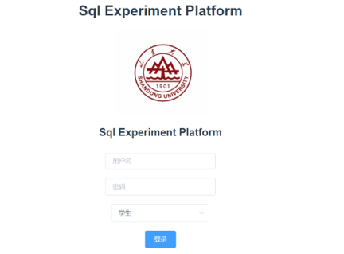
+ 管理员——学生管理界面：可以从该界面管理学生账户，设置账户、姓名、密码。
  + 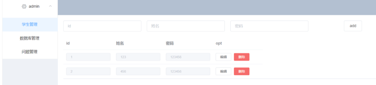
+ 管理员——数据库管理界面：从该页面可以管理所有题目用到的数据库，这样题目就不一定要放在同一个数据库中了。
  + 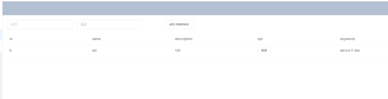
+ 管理员——数据库内Table管理界面：可以在该页面下利用Sql语句创建表格，并且可在Rows选项中查看表格中的数据，以及直接添加/删除表格中的数据，这样临时添加数据就无须执行Sql语句了，方便管理。还可以tableinfo选项中查看表格的详细信息，每个属性的详细定义等。
  + 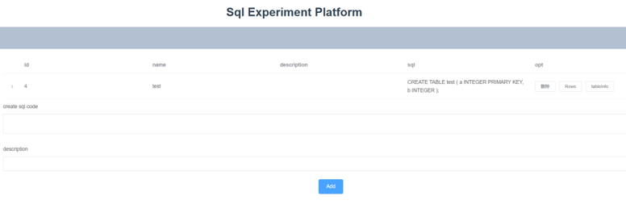
  + 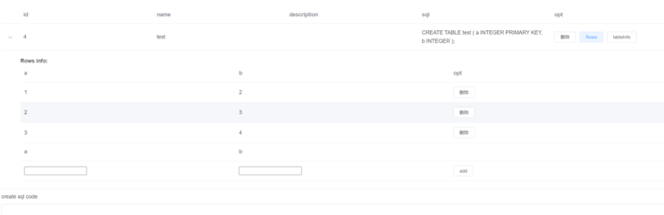
  + 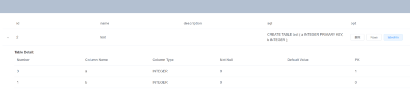
+ 管理员——题目管理界面：可以通过设置标题、题面、得分来添加题目，并且在answer中可以添加多个答案。
  + 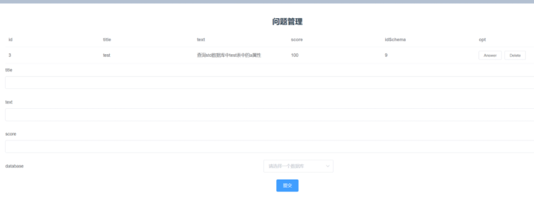
  + 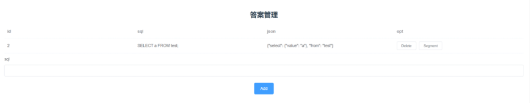
+ 学生——题库界面：在该页面中列出了目前可用的所有题目，学生可以选择相应的进行作答。
  + 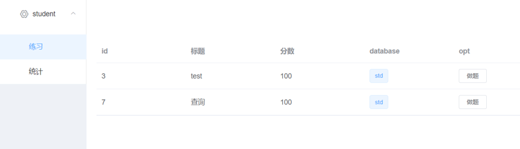
+ 学生——题目界面：在该页面可以查看题目的详细信息，包括题面，所用到的数据库和相关表格的定义，在提交之后可以显示作答的结果标签、得分以及标准答案执行后得到的结果与学生作答执行后的结果。这里因为之前我们使用平台的时候发现有时候自己纠正拼写错误非常浪费时间，所以这里添加了拼写检查功能，可以一定程度检查纠正拼写错误，并给予提示，红色为可能出错。这里利用Levenshtein库进行字符串相似度检测。利用sqlparse格式化SQL代码。利用moz_sql_parser实现SQL分句。
  + 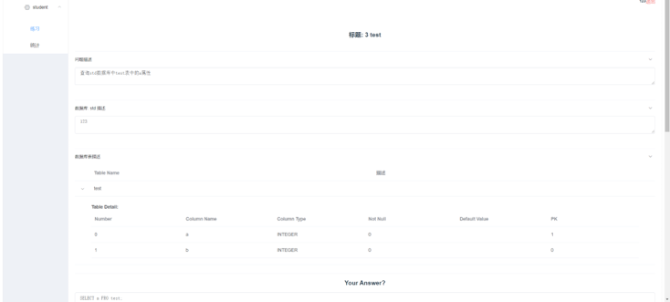
  + 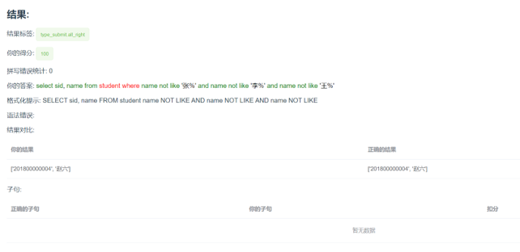
+ 学生——数据统计界面：在该页面中学生可以看到自己作答情况的统计，错误类型统计等，也可以分题目查看，使用ECharts绘制统计图。
  + 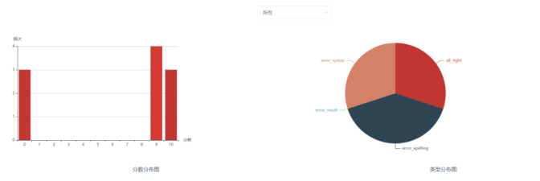

### 2、题目总结

***

+ 主要为以select为基础的题目，考察order by等复杂操作。部分题目参考leetcode，更加贴近实际的使用场景。

### 3、技术架构

***

+ 整体上本系统采用B/S（Browser／Server）架构，前端主要使用Vue作为主体框架，后端主要使用Flask作为主体框架。
  + 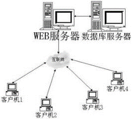
+ 前端
  + 前端主要使用Vue作为主体框架
    + 易用：在有HTML，CSS，JavaScript的基础上，快速上手。
    + 灵活：简单小巧的核心，渐进式技术栈，足以应付任何规模的应用
    + 性能：20kb min+gzip 运行大小、超快虚拟 DOM 、最省心的优化。
  + Vuex作为状态存储
  + vue-router用于提供前端路由功能
  + Axios作为与后端进行HTTP通信的库
  + ElementUI作为美化页面的框架
+ 后端
  + 后端Flask作为主体框架
    + 基于Python的Web框架，旨在构建Web应用程序，微框架，轻量级，扩展插件较多
  + flask_restful提供RESTful API风格的基础框架
    + REpresentational State Transfer，可以通过统一接口为 Web，iOS和Android提供服务
  + SqlAlchemy作为后端ORM框架
    + Python最有名的ORM（Object-Relational Mapping，把关系数据库的表结构映射到对象上）工具包
+ 系统用到的数据库
  + 系统的管理数据库基于MySQL，其中包含的table如图
    + 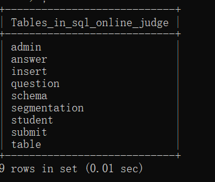
  + admin用于记录管理员账户
  + student用于记录学生账户
  + schema用于记录我们在数据库管理界面创建的数据库
  + question用来记录题目及其执行结果
  + answer用来记录每个题的答案
  + submit用来记录用户的提交，并传给后端验证答案
  + table是记录了数据库中题目table的信息
  + insert是记录了对数据库中的table所有的insert操作
  + segmentation记录了用户的提交记录，用来绘制分析图
  + E-R图如下
+ 用户题目数据库
  + 后台执行用户提交的数据库是Sqlite3，每个用户在备份数据库进行操作，不会互相影响，不过多占用资源，评测方式为评测语句的执行结果。

### 4、总结展望

***

+ 经验
  + 架构使用
  + 数据库的理解
  + 对原有平台问题的改进
+ Future Work
  + 复杂语句的实现
+ 课程改革建议
  + 与python等实用工具的结合
